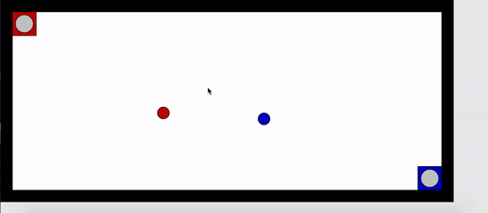

# Javascript inkball
 - Inkball is a video game developed by Microsoft. In the game, you try to direct balls into holes of corresponding colors by drawing lines which the balls bounce off.
 - This game is inkball written in JavaScript

- The ball animation is actually much smoother than what it shows because the gif's frame rate is low

# Status
  - ball bouncing:
    - bounces in correct direction off of walls
    - balls bounce off of each other in correct angle (works VERY WELL)
    - bounces in WRONG direction when it hits lines
      - In release, i'm using a direction changing algorithm, which does not reflect based on the angle of the line
      - I'm trying various algorithms to calculate the ball's direction using the lines direction and the ball's direction
      - sometimes the ball doesn't make the line disappear and does not change direction at all.

  - getting into hole
    - works
    - tells when ball gets in wrong hole

fyi i'm using the processing editor for this project

latest commit will likely be unstable.

